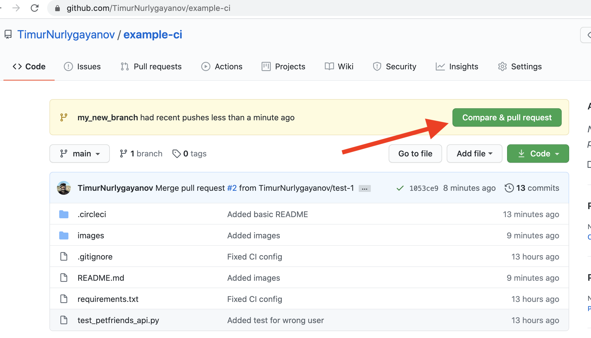
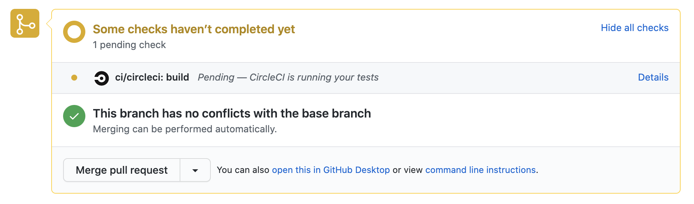
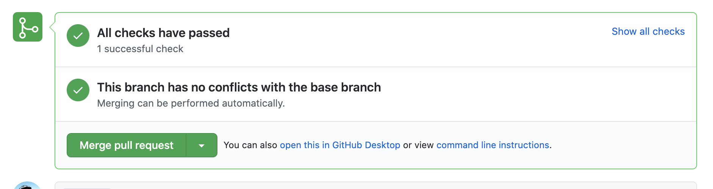

Пример бесплатного Continuous Integration
---------------------
Этот репозиторий является примером базовой настройки
бесплатного CI для гитхаб репозитория.

Непрерывная интеграция (Continuous Integration)
----------------------------------------------
Основная идея практики "Continuous Integration" (CI) в том,
чтобы в любой момент быть готовыми выпустить текущую версию
приложения для реальных пользователей (в "production").

Continuous Integration:
1) Деплой приложения полностью автоматизирован и занимает менее 20 минут
1) Есть отдельное staging / testing окружение, куда происходит
деплой приложения (возможно таких окружений много)
1) Каждое изменение кода проходит все автоматизированные
проверки
1) Все тесты автоматизированы
1) Полный прогон тестов занимает менее 30 минут
(тесты должны проходить как можно быстрее)
1) Нет "случайно падающих" тестов, все тесты максимально
стабильны и всегда успешно проходят для работоспособной
версии кода
1) Любые изменения в код проекта попадают в основную ветку main
**только** если все автоматизированные тесты прошли успешно и 
код был прооверен (прошел ревью) хотя бы одного разработчика
(в идеале это может быть ревью 2-3 разработчиков).
1) Проект может быть задеплоен из ветки main в любой момент,
так как там хранится гарантированно работоспособная версия кода.
 

Как это работает
----------------

Файл [./circleci/config.yml](./circleci/config.yml) содержит
описание настроек для бесплатного CI сервиса 
[CircleCI](https://circleci.com/).

При изменении кода в данном репозитории CircleCI скопирует
новый код к себе и запустит все тесты, результаты 
тестов влияют на то, будет ли новый код "одобрен"
(если тесты прошли) или же изменения будут "заблокированы"
(если тесты не прошли).

Изменения, которые были одобрены (то есть все тесты прошли успешно),
а так же проверены другим разработчиком,
принимаются в основную ветку репозитория.

Если тесты "упали", то разработчик очень быстро узнает о том,
что в его изменениях есть ошибка, и может быстро ее исправить,
отправив уже исправленную версию на проверку.

При таком подходе мы проверяем **каждое** изменение нашего кода,
и в главной ветке репозитория у нас **всегда** хранится версия кода,
которая успешно проходит все тесты.


Как отправить новый код на проверку?
------------------------------------
Все новые изменения делаются в отдельных ветках (git branches),
и после того, как изменения будут приняты, они попадают в
главную ветку main.

Для того, чтобы сделать новую ветку,
нам нужно выполнить такие команды:

```bash
git branch my_new_branch
git checkout my_new_branch
```

После этого нам нужно внести изменения в код,
и, когда все будет готово, выполнить такие команды,
чтобы отправить эти изменения на проверку (обратите внимание,
что мы делаем git push в новую ветку с именем "my_new_branch"):

```bash
git add .
git commit -am "Added new tests for PetFriends REST API"
git push origin my_new_branch
```

Теперь можно открыть репозиторий 
https://github.com/TimurNurlygayanov/example-ci и мы увидим
предложение сделать pull request (нажмите на эту кнопку)


После того, как pull request готов, Circle CI запустит наши 
тесты, и, пока тесты не прошли, мы можем видеть такой статус:


Когда тесты прошли, статус изменяется:


Когда все тесты пройдены успешно, кнопка "Merge pull request" становится
ярко-зеленой, и так мы понимаем, что эти изменения безопасны и могут быть
внесены в основную ветку репозитория (main).


Примеры
-------
Пример изменений, которые прошли CI проверку:
https://github.com/TimurNurlygayanov/example-ci/pull/5

Пример изменений, которые не прошли CI проверку,
потому что там есть ошибка:
https://github.com/TimurNurlygayanov/example-ci/pull/4
